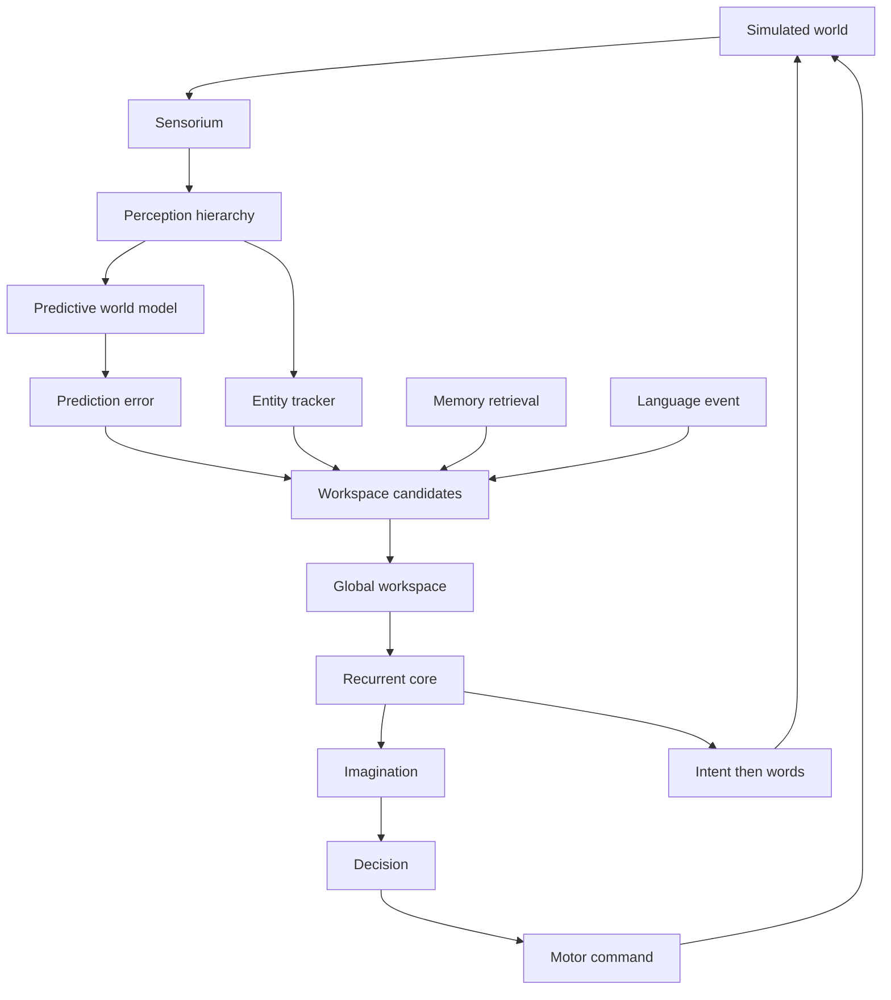
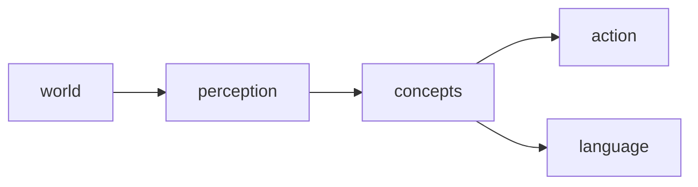

# Diagrams

## Organism loop

```mermaid
flowchart TD
  W[Simulated world] --> S[Sensorium]
  S --> P[Perception hierarchy]
  P --> E[Entity tracker]
  P --> WM[Predictive world model]
  WM --> PE[Prediction error]
  PE --> C[Workspace candidates]
  E --> C
  M[Memory retrieval] --> C
  L[Language event] --> C
  C --> G[Global workspace]
  G --> R[Recurrent core]
  R --> I[Imagination]
  I --> D[Decision]
  D --> A[Motor command]
  A --> W
  R --> LANG[Intent then words]
  LANG --> W
```

## Language is not the mind

```mermaid
flowchart LR
  world --> perception --> concepts
  concepts --> action
  concepts --> language
```
